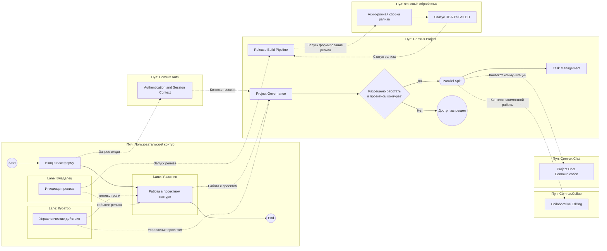

# BPMN 2.0 L1 (приоритет: foundation-модель)

Этот файл содержит отдельную L1-диаграмму BPMN в формате Mermaid.
Базой служит каноническая модель из `bpmn_collaboration_processes_foundation.md`.

IDEF0 используется как вспомогательная валидация покрытия функций,
но не как жесткий шаблон структуры BPMN.

## Канонические L1-подпроцессы (источник: foundation)

1. `Authentication and Session Context` (`Comrux.Auth`);
2. `Project Governance` (`Comrux.Project`);
3. `Collaborative Editing` (`Comrux.Collab`);
4. `Project Chat Communication` (`Comrux.Chat`);
5. `Task Management` (`Comrux.Project`);
6. `Release Build Pipeline` (`Comrux.Project` + `Фоновый обработчик`).

## Справочная привязка к IDEF0 (не обязательная 1:1)

- Блоки `A1/A2` в основном покрываются `Authentication and Session Context` + `Project Governance`.
- Блок `A3` покрывается `Collaborative Editing`.
- Блок `A4` покрывается `Release Build Pipeline`.
- Элементы про планирование/обсуждение задач покрываются `Task Management` + `Project Chat Communication`.

## L1-диаграмма (Mermaid)

## Правило чтения диаграммы

- `P1 -> P2` формируют вход и управляемый проектный контур.
- После проверки доступа в `P2` начинается параллель: `P3` (редактирование), `P4` (чат), `P5` (задачи).
- `P6` отображается как отдельный верхнеуровневый процесс, запускаемый по событию.
