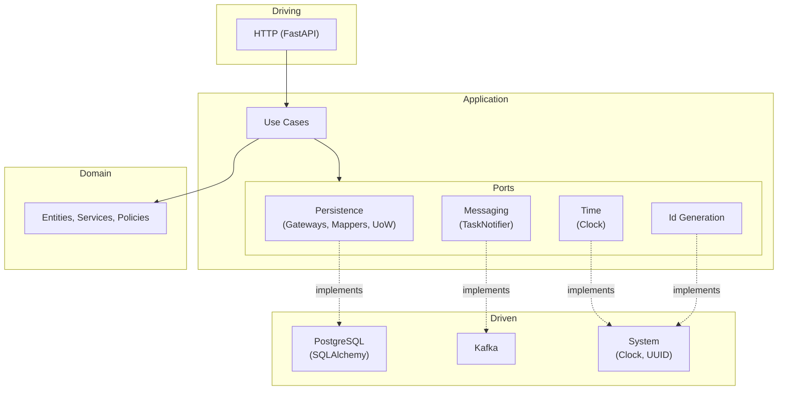

# Гексагональная архитектура Comrux.Project

Диаграмма отражает слои и зависимости приложения в стиле Ports & Adapters (Hexagonal Architecture).

---

## Mermaid: Hexagonal Architecture Diagram



---

## Структура каталогов

| Слой | Путь | Назначение |
|------|------|------------|
| **Domain** | `src/domain/` | Entities, Value Objects, Domain Services, Ports, Policies |
| **Application** | `src/application/` | Use Cases, Compositions, Ports, Application Services |
| **Infrastructure** | `src/infrastructure/` | SQLAlchemy Gateways, Mappers, ORM Models, Adapters |
| **Presentation** | `src/presentation/` | FastAPI Controllers, Handlers, Presenters |
| **Setup** | `src/setup/` | Dishka Providers, конфигурация |

---

## Правило зависимостей

```
Presentation → Application → Domain
     ↑              ↑
Infrastructure ─────┘
```

- **Domain** — не зависит от других слоёв
- **Application** — зависит только от Domain
- **Infrastructure** — реализует порты Application и Domain
- **Presentation** — зависит от Application, вызывает Handlers и Compositions
