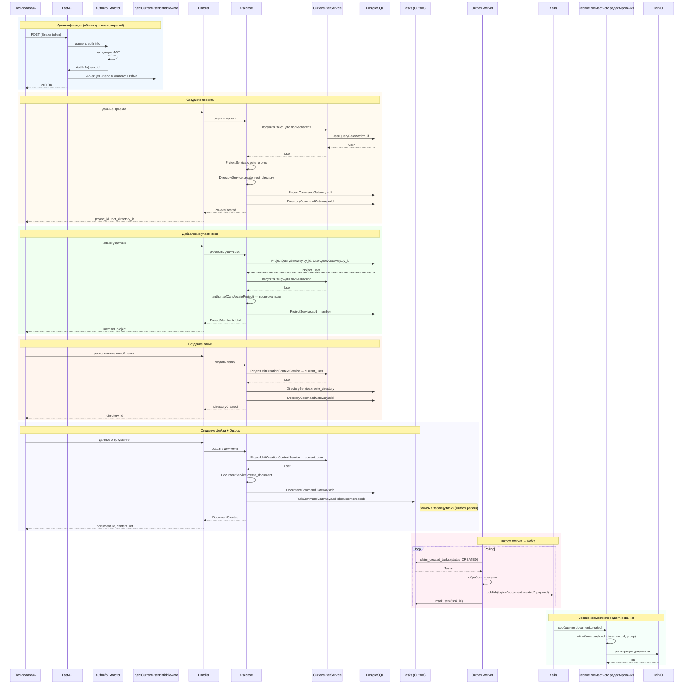
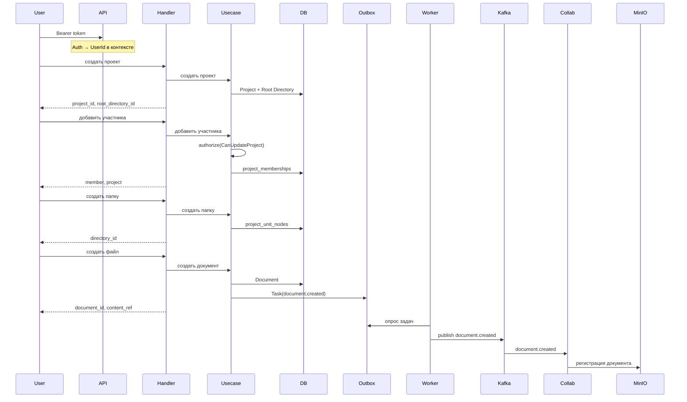

# Диаграмма последовательности: создание структуры проекта

Диаграмма описывает полный поток от входа пользователя до регистрации документа в сервисе совместного редактирования.

---

## Mermaid: Sequence Diagram

---

## Текстовая схема потока

### 1. Аутентификация (общая логика)
- Пользователь отправляет запрос с Bearer-токеном
- `InjectAuthInfoMiddleware` → `AuthInfoExtractor` извлекает `user_id` из JWT
- `InjectCurrentUserIdMiddleware` помещает `UserId` в контекст Dishka
- `CurrentUserService` (инжектится с `UserId`) используется во всех usecase для получения `User`

### 2. Создание проекта
- `CreateProjectHandler` → `CreateProjectComposition` → `CreateProjectUsecase`
- `CurrentUserService()` → `User`
- `ProjectService.create_project` + `DirectoryService.create_root_directory`
- Сохранение в БД: `ProjectCommandGateway`, `DirectoryCommandGateway`

### 3. Добавление участников
- `AddProjectMemberHandler` → `AddProjectMemberUsecase`
- Загрузка проекта и пользователя: `ProjectQueryGateway.by_id`, `UserQueryGateway.by_id`
- `CurrentUserService()` → текущий пользователь
- `authorize(CanUpdateProject)` — проверка прав на обновление проекта (добавление участников)
- `ProjectService.add_member` → обновление `project_memberships`

### 4. Создание папки
- `CreateDirectoryHandler` → `CreateDirectoryComposition` → `CreateDirectoryUsecase`
- `ProjectUnitCreationContextService` даёт `current_user`, `project`, `parent_directory`
- `DirectoryService.create_directory` → `DirectoryCommandGateway.add`

### 5. Создание файла и Outbox
- `CreateDocumentHandler` → `CreateDocumentComposition` → `CreateDocumentUsecase`
- `DocumentService.create_document` → `DocumentCommandGateway.add`
- **Outbox**: `TaskService.create_task("document.created", {document_id, group})` → `TaskCommandGateway.add`
- Задача пишется в таблицу `tasks` в той же транзакции, что и документ

### 6. Outbox Worker → Kafka
- `TaskPollingWorker` периодически опрашивает `tasks` (status=CREATED)
- `ProcessTasksComposition`: `claim_created_tasks` → `KafkaTaskNotifier.notify_batch`
- Публикация в Kafka: `topic=task.task_type` (например, `document.created`)
- После успешной отправки: `mark_sent(task_id)`

### 7. Сервис совместного редактирования
- Подписан на топик Kafka `document.created`
- Получает payload: `{document_id, group}`
- Регистрирует документ в MinIO для совместного редактирования

---

## Упрощённая диаграмма (без дублирования CurrentUserService)

---

## Ключевые компоненты

| Компонент | Роль |
|-----------|------|
| `CurrentUserService` | Получение текущего пользователя по `UserId` из контекста (используется во всех usecase) |
| `ProjectUnitCreationContextService` | Контекст для создания unit: current_user, project, parent_directory |
| `TaskService` + `TaskCommandGateway` | Outbox: создание и сохранение задач |
| `KafkaTaskNotifier` | Публикация задач в Kafka (topic = task_type) |
| `TaskPollingWorker` | Опрос таблицы tasks и отправка в Kafka |
